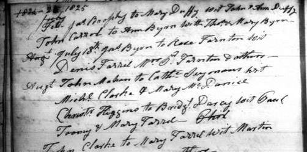
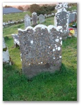
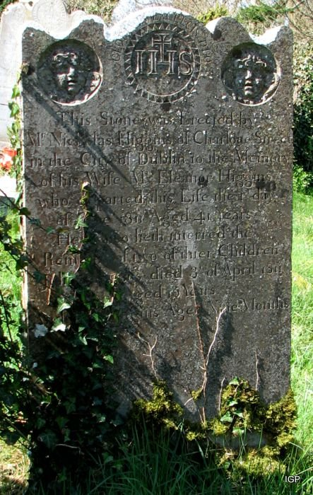
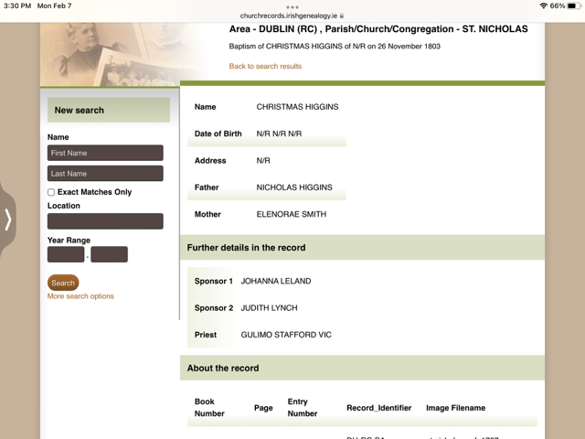
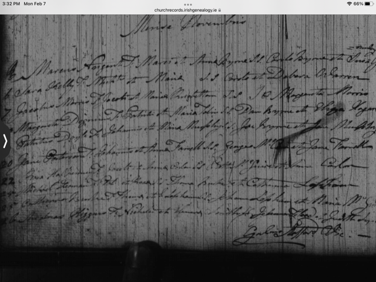
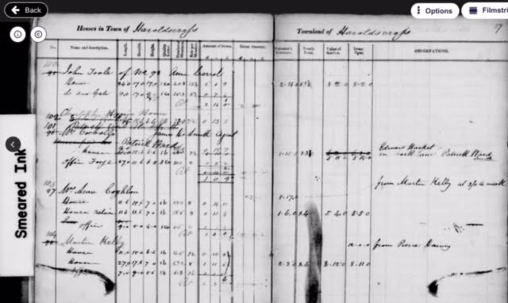
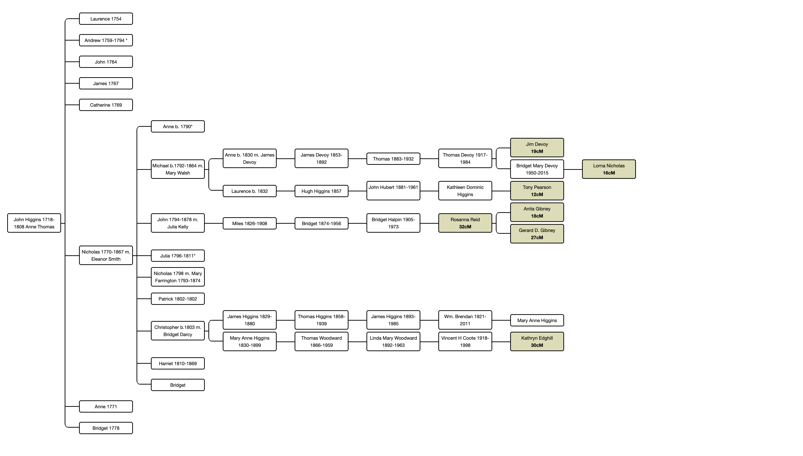
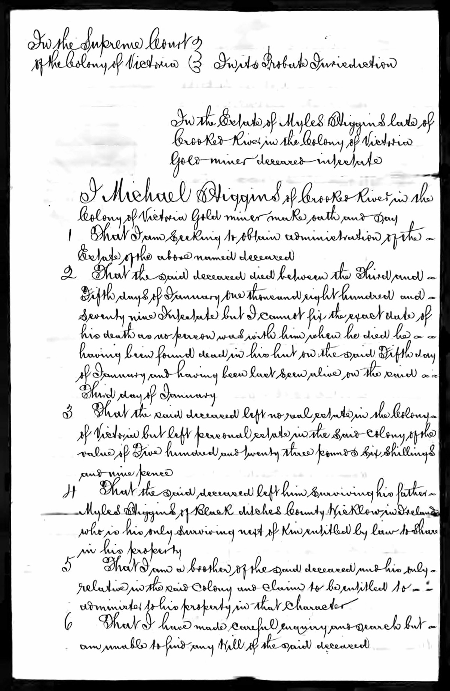

**<u>Higgins DNA & Wicklow Townlands</u>**

> **<u>Christopher Higgins & Bridget Darcy</u>**

**By Mary Anne Higgins <himaryanne@gmail.com> revised March, 2022**

This document is the result of my research in trying to figure out who
the parents are of Christopher Higgins and Bridget Darcy. Through other
Family trees, DNA matches, primary research, and verification of
documents, I have been able to connect our Higgins family to a larger
Higgins family. I would like to thank the following people Tony Pearson,
Lyn Higgins, Kathryn Edghill, Anita Gibney Ryan, Stephen Jones for their
input. I’ve relied heavily on Tony Pearson’s tree and research. Through
our correspondence, he has been very patient with all my queries and has
been extremely helpful with his insights. Lyn Higgins’s lynpodge tree
and research were helpful, too. She also corresponded with me and shared
some names of individuals with DNA matches to the family that I missed.
Kathryn Edghill for her family tree which I saw two years ago and piqued
my interest. She read the first draft and was very supportive in her
comments. Once again, Stephen Jones, a third cousin once removed
(descended from Thomas Higgins’s 1858-1939 brother, James 1856-1899),
was helpful in sharing his ideas when he read the first draft and when I
found new information. Lastly, I would like to thank Anita Gibney Ryan
for her correspondence and information. Her mother, Rosanna Reid was
helpful with placenames as she grew up in and still lives in the area.
They are so fortunate to live in County Wicklow. I firmly believe that
like many things in life, collaboration yields the best results. For
family history and genealogy, it certainly does, too …if it’s accurate.
Let’s hope what I put forth in this document is.

Christopher Higgins and Bridget Darcy, our MRCAs, our most recent common
ancestors, were married in August 1825 in the Catholic Parish of
Blackditches, also referred to as Boystown and as Valleymount, in the
Diocese of Dublin which encompassed County Dublin and parts of Counties
Wicklow and Kildare. The town of Valleymount itself is in County
Wicklow.

<https://registers.nli.ie/registers/vtls000633349#page/76/mode/1up>

My shared DNA matches and research confirm Christopher Higgins and
Bridget Darcy were from the environs of Valleymount, Co. Wicklow.
Christopher Higgins’s family of origin, parents and siblings, were from
this north-western area of County Wicklow which to its west is very,
very close to the border County Kildare and to the north to the border
of County Dublin.

In regard to Bridget Darcy, I still have not had any DNA matches to
anyone descended from her parents or siblings so the focus of this paper
is on the Higgins family. I have found one reference to the Darcy name
in one of the townlands that I refer to regarding who her father
possibly could be.

My shared DNA matches indicate we are descended from and related to
Higgins’s from three townlands in this area of Wicklow: Carrigacurra
which is close to Valleymount and Carrig and Ballynatona which are close
to Blessington. Geography is important in genealogy as generally people
did not move around very much in the past. I could not find a map of the
area showing the townlands so the following are links to the location of
each townland. The maps can be zoomed in and out to understand their
geographical location.

Carrigacurra –

<https://www.townlands.ie/wicklow/lower-talbotstown/boystown/togher/carrigacurra/>

Carrig -
<https://www.townlands.ie/wicklow/lower-talbotstown/boystown/lackan/carrig/>

Ballynatona-

<https://www.townlands.ie/wicklow/lower-talbotstown/blessington/blessington/ballynatona>

**<u>SHARED DNA MATCHES & FAMILY TREES FROM ANCESTRY</u>**

**<u>TONY PEARSON DNA & TREE ON ANCESTRY</u>**

I will start with my DNA match of Tony Pearson who lives in Adelaide,
Australia and whose username is apjp2007 on Ancestry. I have a DNA match
of 12 cM/1 segment , 15 cM for both the unweighted and longest segment.
The predicted relationship is that we could 5th to
8th cousins. Unfortunately, because our match is less than
20cM, Ancestry doesn’t show us our possible shared matches.

Tony has an extensive family tree which is public. If you’re on
Ancestry, do a member search using his username apjp2007. For readers
not on Ancestry, it’s free to sign up on Ancestry and you can search and
see his family tree. His tree generally appears to be a well-researched
and well-documented tree, and I have done some of my own research to
verify the documentation.

His tree begins with John Higgins born in Wicklow in 1718, parents
unknown dying on Sept.24, 1808 and being buried at Baltyboys Cemetery,
Valleymount, Wicklow. His wife was Anne Thomas, born 1733, Dublin,
parents unknown, died June 24, 1773, and is also buried at Baltyboys
Cemetery. They had eight children:

Laurence b. 1754 - *unverified*

Andrew abt. 1759-1794 – *verified from tombstone & intestate probate of
1794*

John b. 1764, Wicklow -1837 - *unverified*

\*James b.1867, Wicklow – *possibly verified by Tithe Applotments &
Griffith’s Valuation*

Catherine bapt. Jan. 8, 1869, St. Nicholas, Dublin,

> sponsors Thomas Higgins\* & Maria Hughes, verified \*brother of John?

\*\*Nicholas 1770, Dublin – died abt 1867 – *birth unverified, possibly
verified by Tithe Applotments* *& Griffiths Evaluations*, *verified by
his name on his parents’ tombstone*

Anne b. 1771 -*unverified, incorrect record in apjp2007 tree*

Bridget - Feb. 7, 1778, St. Catherines, Dublin, -1817 *baptism verified,
doubt death record*

The following are an image and text and weblinks of the tombstone
proving Nicholas Higgins lived on Charlotte St. in Dublin and that his
parents were John Higgins and Anne Thomas and that he had a brother
Andrew.

<http://www.igp-web.com/IGPArchives/ire/wicklow/photos/tombstones/1headstones/baltyboys03.txt>

No. 399

IHS \| This Stone Was Erected By \| Mr NICHOLAS HIGGINS \| Of Charlotte

Street City Of Dublin \| Here Rest The Remains Of His Mother \| ANNE

HIGGINS Who Died \| 24th June 1773 Aged 40 Years \| Also Those Of His

Brother \| ANDREW HIGGINS Who Died \| 1794 Aged 35 Years \| Likewise

Those Of His Father \| JOHN HIGGINS Who Died \| 24th Septemr 1808 Aged

90 \| \[Disappears into ground at this point. However, there may not be

anything more written\]

<https://www.igp-web.com/IGPArchives/ire/wicklow/photos/tombstones/wicklow-baltyboys-3/target111.html>

\*\*There are two dates that don’t synchronize with each other. There is
a baptismal record for Bridget Higgins for Feb.7,1778 at St. Catherine’s
in Dublin and the parents of her are listed as John Higgins and Anne
Thomas. On the tombstone it gives the date of June 24, 1773 as Anne’s
death date. Could it be 1778, and not 1773?

Nicholas Higgins b.1770-d.1867 married Eleanor Smith in or before 1790
when their first child, Anna is born. Eleanor Smith was baptised
Nov.30,1769 at St. Paul’s, Dublin and her parents were Patrick and Sarah
Smith, verified.

On Tony Pearson’s family tree, he has listed them as having seven
children:

Anna Higgins 21 Mar 1790 baptism verified

\*Michael Higgins 1792-1864 no baptismal record, verified by other
records

Julia Higgins 1796-3 Apr 1811 no baptismal record, death verified on
gravestone

\*John Higgins 6 Apr 1797-1878 baptism verified, verified by other
records

Nicholas Higgins 1798 no baptismal record, verified by other records

Patrick Higgins 1802-1802 baptism verified; death verified on gravestone

\*\*\*

Bridget Higgins ? unverified

The following are an image and text, and web links of the tombstone
Nicholas Higgins of Charlotte St. in Dublin (incorrect transcription of
Charlotte St.) erected for his wife, Eleanor and two of their children,
Julia and Patrick.

<https://www.igp-web.com/IGPArchives/ire/wicklow/photos/tombstones/wicklow-kilbride-manor/target95.html>

<http://www.igp-web.com/IGPArchives/ire/wicklow/photos/tombstones/1headstones/kilbride-old.txt>

No.96

This Stone was erected by \| NICHOLAS HIGGINS of Charlotte Street \| in

the City of Dublin to the memory \| of his wife Mrs. ELEANOR HIGGINS \|

who departed this life the 1st day \| of June 1811 aged 41 years \| Here

also lieth interred the \| remains of two of thier(sic) children \|

JULIA HIGGINS died 3rd of April 1811 \| aged 15 years \| and PATK

HIGGINS aged nine months.

Interesting that both his wife, Eleanor and his daughter Julia died and
were buried in 1811. I wonder what they died from. From the same
illness, perhaps?

Nicholas Higgins must have erected both these tombstones in 1808 and
1811 respectively when he was living on Charlotte St. in Dublin.
Charlotte St. doesn’t exist anymore but for more information on its
location, here is a link:

https://wideandconvenientstreets.wordpress.com/2013/04/07/[charlotte](https://wideandconvenientstreets.wordpress.com/2013/04/07/charlotte-street-now-gone/)-street-now-gone/

Tony Pearson is descended from Nicholas b.1770-d.1867

This is his lineage:

John Higgins 1718-1808, Co. Wicklow

Married abt. 1753- Anne Thomas, 1733-24 Jun 1773 ?

Nicholas Higgins 1770, Dublin – aft.1867, Dublin

Married abt 1790- Eleanora Smyth, 1769-1811

Michael Higgins 1792, Ballinatona- Nov. 5, 1864, Ballinatona, Manor
Kilbride, Married 1812-15, Wicklow- Mary Walsh 1795-1865

Laurence Higgins Feb 5, 1832, Ballynatona- June 5, 1891, Birkenhead

Married Oct 16, 1854, Wicklow - Alicia Bradford 1832-1904

Hugh Higgins 1857-1937, Birkenhead, England

John Hubert Higgins 1881-1961, Birkenhead, England

Kathleen Dominic Higgins Pearson 1913, Birkenhead-2007, Kensington, SA,
Australia

As you can see his descendants are from Ballinatona or Ballynatona
Townland which is adjacent to Carrig Townland. It appears from various
records such as baptismal, marriage and death records, the Tithe
Applotments and Griffith’s Valuations and from gravestone inscriptions
that during the early 1800s, the Higginses went between the County &
City of Dublin and Ballynatona Townland in County Wicklow. They must
have been a prosperous and industrious farming family.

**<u>WHO ARE THE PARENTS OF CHRISTOPHER HIGGINS?</u>**

When I initially looked at Tony Pearson’s family tree, I thought that
our Christopher Higgins could possibly be a son of James Higgins, b.1767
to John Higgins and Anne Thomas. There is no doubt that through the DNA
matches and the family trees and genealogical records, our Higgins’s are
from this area of Co. Wicklow. Assuming we know of all the children born
to Christopher Higgins and Bridget Darcy, and James was the firstborn,
and born between 1826-29, and by following Irish naming traditions, then
we are looking for a James Higgins as the father of Christopher. Looking
at Tony Pearson’s family tree, John Higgins b. 1718- 1808 had a son,
Nicholas b. 1770, whom Tony Pearson is descended from, but John Higgins
also had a son, James born in 1767 who is possibly the same James
Higgins who is listed with Nicholas Higgins and Michael Higgins in the
Tithe Applotment Books of 1833 as having arable pasture at Ballynatona
Townland. This James could be the father of our Christopher Higgins. The
birth dates of James b. 1767 and Christopher being born in or before
1804, (assuming he married at full age of 21 when he married in 1825)
align with them possibly being father and son. If I am correct that
James, my gt.gt. grandfather is the first male born between 1826-1829 to
Christopher and Bridget then it fits the pattern of the Irish naming of
children – first male child is named after the father’s father.

<http://titheapplotmentbooks.nationalarchives.ie/search/tab/results.jsp?surname=Higgins&firstname=&county=Wicklow&townland=&parish=&search=Search&sort=&pageSize=&pager.offset=0>

This hypothetical father-son relationship was very plausible until I was
verifying baptismal records in early February 2022 of Nicholas Higgins’s
and Eleanor Smith’s 7 children originally listed in Tony Pearson ‘s
family tree’ and came across a baptismal record while searching using
the key words ‘Nicholas Higgins’, not ‘Christopher Higgins’.

The baptismal record I came across was for a Christopher Higgins
baptised Nov. 26, 1803 at St. Nicholas, Dublin, child of Nicholas
Higgins and Eleanora Smith. As you can see on the transcription that
Christopher’s name was transcribed as Christmas! No wonder I couldn’t
find it searching with his first name! The transcriber certainly didn’t
know Latin or had poor eyesight! On the actual record, it is the last
entry at the bottom of the page. I shared this information with Tony
Pearson, and he has since added Christopher to his tree. He and Stephen
Jones, 3rd cousin once removed and descended from James
Higgins b. 1856, believe this is our Christopher Higgins. His baptismal
date of Nov. 26, 1803, and his marriage date of August 1825 would make
him full age of 21 years to be married. If he is the son of Nicholas and
Eleanora, it doesn’t explain some of the names of his children. Tony
Pearson has observed that some of the Higgins families in his tree
didn’t follow the traditional naming of children. Maybe there was
another Christopher in the family that we have no record of.

I will be using a chart from the DNA Painter website as to which
relationship is more plausible, son of James b.1767 or son of Nicholas
b.1770, but I am beginning to think, like Tony Pearson and Stephen
Jones, that it is the latter.

On a few family trees, Christopher Higgins’s parents are listed as
Patrick Higgins and Mary Johnstone. I firmly believe his parents are not
Patrick Higgins and Mary Johnstone of Kilcock in the Diocese of Kildare
and Leighlin. Kilcock in County Kildare is too far from
Valleymount/Blackditches in County Wicklow, 45 kilometres away. Also,
there are no sons or grandsons named Patrick in Christopher’s or his
children’s families. I have no DNA matches from that area of Kildare
either and my ethnicity estimate on Ancestry puts me in the community of
Wicklow, Carlow & Wexford meaning the bulk of my shared DNA matches are
from this area. I shared this information with Kathryn Edghill, a
4th cousin in Australia and descendant of Mary Anne Higgins,
daughter of Christopher Higgins and Bridget Darcy who emigrated to
Australia in 1854 and married Wm. John Woodward in 1859, and she agrees
that Patrick Higgins and Mary Johnstone are not the parents of
Christopher Higgins.

Another interesting observation is that on Tony Pearson’s tree, besides
Nicholas Higgins having arable pasture in 1830 in Ballynatona, (if it is
the same Nicholas) he is listed in the Tithe Applotments Books as having
land in Rathgar, Rathfarnham, County Dublin in 1825. I’m assuming he
moved from Charlotte St. after 1811 and before 1825.

<http://titheapplotmentbooks.nationalarchives.ie/search/tab/results.jsp?surname=Higgins&firstname=&county=Dublin&townland=&parish=&search=Search&sort=&pageSize=&pager.offset=0>

Perhaps this is the family connection as to why Christopher Higgins and
Bridget Darcy went to County Dublin. Their son, Thomas was baptized
January 3, 1833, at Rathfarnham, their daughter Anne was baptized Dec.
1, 1837, in which her parents are listed as Christopher Higgins and
Bridget Darcy at St. Catherine’s in the city, and their last child,
Margaret was baptized Nov.29, 1840 at Rathmines, again parents listed as
Christopher Higgins and Bridget Darcy.

Here is a record from the Ireland Valuation Office Books on
FindMyPast.ie of a Christopher Higgins having a small house in Harold’s
Cross in 1845.

Transcription:

<https://www.findmypast.com/transcript?id=IRE%2FCENSUS%2FVALUEBOOKS%2F1018893>

Actual record:

<https://search.findmypast.com/record?id=IRE%2FCENSUS%2F1821-51%2F007246843%2F00549&parentid=IRE%2FCENSUS%2FVALUEBOOKS%2F1018893>

There is also Quarto Book record from the Irish Valuation Office Books,
but with no year given, with a record of a Christopher Higgins with his
named lined out, and another name, Tom Keenan, written beside it and
renting from a Charles Johnson. I don’t know if this record is from
before or after the 1845 record. This is more than likely our
Christopher Higgins as Harold’s Cross is very close to Rathmines where
four of his children were married at Rathmines Church:

James Dec.23, 1850 to Jane Eustace

Thomas Nov. 18, 1855 to Bridget Brereton

Catherine April 13, 1856 to James Dempsey

Anne \* June 3, 1860 to Laurence Keane

\* only entry that has parents’ names - ‘Anne of Rathgar of Christopher
& w. Bridget Higgins’

Also, it appears James Higgins and his wife, Jane Eustace settled and
raised their family in Harold’s Cross as there are numerous records,
more specifically, birth records of three of their children, William
b.1864, Michael b.1866, and Mary Jane b. 1867 being born at Loughawn,
Harold’s Cross, and birth records of their last two children, Catherine
b. 1871 and Edward b. 1873, and death records of James in 1880 and Jane
in 1911 and workhouse records of Jane in 1908 with 6 Fulham’s Lane,
Harold’s Cross as their address. I can’t locate either Loughawn or
Fulham’s Lane on a current city map of Dublin but haven’t searched any
historical maps. I don’t know if they are two separate places or if they
are one and the same.

**<u>LYNPODGE FAMILY TREE ON ANCESTRY</u>**

Another Higgins family tree on Ancestry is lynpodge’s. To find this
tree, go to Search, then Member Search and type in lynpodge. She has 5
family trees, one of them being her husband’s Higgins family tree. She
lives in Victoria, Australia. Her husband’s name is Paul Higgins and I’m
not a DNA match to him, but other extended family members are.

This Higgins family tree begins with the couple Miles Higgins b. abt.
1814-d.1879 and Mary Farrington b. abt. 1814 – d. 1879 who were born and
died in Blackditches parish. They also married about 1835 in
Blackditches. Their births/baptism dates and marriage date have not been
verified by documentation. Miles’ parents are unknown and Mary
Farrington’s parents are listed as James Farrington b.1785 and her
mother possibly being named Mary or Ann. Both are not verified. I found
a baptismal entry in Blackditches for a Mary Farrington June 17, 1814,
parents James & Ann Farrington, sponsors Patrick and Catherine Cullen
which is more than likely hers. Lynpodge has a possible marriage for a
James Farrington to an Ann Costello on Feb. 17,1806 at St. Catherine’s,
Dublin.

Lynpodge has listed the children of Miles Higgins and Mary Farrington
and has records of the baptisms of all the children at Blackditches
except for James Anthony b.1857-1925. For all the baptisms the parents
are listed as Miles & Mary Higgins except on Elizabeth’s and Thomas’s in
which they are recorded as Myles Higgins and Mary Farrington. Also, none
of the entries state the townland except for Thomas’s 1860 entry which
is recorded as Carrigacurra which is close to Valleymount where the
parish church was located. During this time, it went by the name of
Blackditches. I have listed the sponsors’ names as they support the fact
that Mary’s maiden name was Farrington.

Miles July 14, 1836 John Higgins & Ann Farrington

Patrick Dec. 30, 1838 Michael Farrington & Mary Higgins

Mary Dec.11, 1841 Joseph Fitzpatrick & Catherine Farrington

Elizabeth April 26, 1844 Patrick Farrington & Anne Quinn

Anne June 19, 1846 James Norton & Anne Doyle

Michael Aug 23, 1847 James Doyle & Eliza Farrington

James Anthony b. 1857- *baptismal entry not found, not verified, will
research on nli.ie*

Thomas b. 2 Oct 1860, baptized Oct. 4, 1860 Patrick Kelly & Bridget
Kelly

Two of their sons, Miles and Michael emigrated to Australia; Michael in
1864, and Miles in 1865, both disembarking at Victoria. Unfortunately,
Miles died in 1879 while Michael married and had five sons and two
daughters. At the end of this paper is the probate record of Miles
Higgins as it confirms the family relationship and that they are from
Blackditches. Unfortunately, it doesn’t state the townland. In the
document Miles is spelled as Myles.

As an aside, it’s interesting that they were both gold miners and that
Christopher Higgins, born abt 1834 – d.1866, son of Christopher Higgins
and Bridget Darcy also went to Australia. Christopher Higgins arrived
July 6, 1858, in Melbourne on the Lincolnshire and is listed as a gold
miner and aged 24 and travelling alone. Various minerals were mined in
the Wicklow Mountains and Valleymount was not far from the mountains. In
Christopher’s case, I don’t know if he ever did go to the gold mines in
Australia, but he ended up being a publican in Sydney before he passed
away in 1866 at the age of 32.

From Michael’s family of seven, I have two shared matches, Warwick
Patterson and ‘amanda patterson’ both living in Australia. Both their
public trees indicate they are siblings and are descended from Michael
and Hannah nee Flannagan; daughter Catherine Higgins 1895-1958, then
Margaret H. Hurley 1921-1997, then private, and then them. You can see
their trees on Ancestry by searching their names as spelled above.

I share 11 cM across 1 segment with both. For Amanda both the unweighted
shared DNA and the longest segment is 11 cM. We have shared matches with
Rosanna Reid who lives in Ireland and Mary Ulm who lives in the USA. For
Warwick, it’s the same: 11 Cm for unweighted shared DNA and the longest
segment. Warwick and I have a shared DNA match with ‘deborah Thompson’
in the USA. Deborah and I share 35 cM across 1 segment, but the
unweighted shared DNA and longest segment are 52cM. Deborah’s maiden
name is Higgins, and she is descended from Thomas Higgins b.1833,
brother of my gt.gt. Grandfather, James Higgins born between 1826-1829,
possibly Rathgar- d.1880, Harold’s Cross, both sons of Christopher
Higgins & Bridget Darcy. We are fourth cousins.

Two other sons of Miles Higgins and Mary Farrington, James Anthony and
Thomas emigrated to the USA. Thomas emigrated in 1885, married in 1886
in St. Louis and had 2 sons. They may have emigrated together, or Thomas
followed James Anthony. I have DNA matches to three female descendants
of James Anthony Higgins b. 1857: two sisters, Carol Grzeskowiak Horst
and Mary Grzeskowiak Ulm, and their aunt, Elaine Higgins Horn.

James Anthony Higgins, born about 1857 in Wicklow and died in 1942 in
St. Louis, Missouri had five sons and one daughter.

Carol Horst and Mary Ulm lineage is

Thomas J. Higgins 1888-1961, grandfather

Frances C. Higgins 1921-2018, mother

Elaine Rose Higgins Horn 1935-2019 is the daughter of Edward J. Higgins
1904-1974, brother to Thomas J. Higgins

My biggest match is with Carol Horst of 22cM across 2 segments. The
unweighted shared DNA is 28cM and the longest segment is 20cM, and the
predicted relationship is 4th to 6th cousin. She
is a not a fourth cousin but possibly a fifth cousin or sixth cousin.

Carol Horst and I have DNA matches to

-Mary Ulm, (30 cM/2 segments) who is her sister. Her other shared
matches with me are MF Cullen and Jason Hayde, both of whom I haven’t
figured out how we’re related, and ‘rosanna reid’.

-M.C. managed by blueisland49 who only matches Carol Horst and whom I
don’t know.

-kedghill (30 cM/2 Segments), who is Kathryn Edghill, a fourth cousin
living in Australia who I’ve been in contact with and share genealogy
information with. She is a descendant of Mary Anne Higgins Woodward
(1832-1899), daughter of Christopher Higgins & Bridget Darcy; she
emigrated as a young single woman by herself in the 1850s.

The third match I have to the American descendants of James Anthony
Higgins, son of Miles Higgins of Carrigacurra is Elaine Higgins Horn at
8 cM across 1 segment who also has shared matches to Carol Horst and
Mary Ulm, from the USA who are her nieces. She also has shared matches
to Eileen Guyette in the USA, who is descended from William Higgins,
b.1864, younger brother to my great Grandfather, Thomas Higgins; J.M.,
managed by Bernadette McCabe, from Australia who is descended from Mary
Anne Higgins Woodward, daughter of Christopher Higgins & Bridget Darcy;
and Rosanna Reid in Ireland. She also matches MF Cullen and M.C.,
managed by blueisland49.

And lastly the most significant shared match is Rosanna Reid (rosanna
reid) whom I match at 32cM across 2 segments, with an unweighted shared
DNA of 34 cM and the longest segment of 18 cM and a predicted
relationship of 4th-6th cousin. She is either a
5th or 6th cousin. I have a shared DNA matches
with her son and daughter. Her son Gerard D. Gibney (gerard_d_gibney)
shares 27cM across 2 segments with me, unweighted shared DNA is 39 cM
and longest segment is 21 cM, and predicted relationship is
4th – 6th cousin. I also match her daughter, Anita
Gibney Ryan. We have a shared DNA of 18 cM across 2 segments, an
unweighted shared DNA of 25 cM and the longest segment being 18cM. Our
predicted relationship is 5th – 8th cousin.
Rosanna Reid also has shared matches to Carol Horst and Mary Ulm. Using
Anita Gibney Ryan’s tree this is their lineage

Nicholas Higgins 1770-1867 & Eleanora Smith 1770-1811

John Higgins & Julia Kelly

Miles Higgins 1826-1908 & Rosanna Balfe 1834-1895 m.1857, Blackditches

Bridget Higgins 1874-1956 & Patrick Halpin 1872-1943

Bridget Halpin 1905-1973 & Christopher Reid

Rosanna Reid 1935-living & Gerard F. Gibney 1934-2019

Gerard D. Gibney

Anita Gibney Ryan

When I say Rosanna Reid is a significant match, it’s because she is the
only match that has remained in this area of Wicklow. She lives in
Lackan which is right by or within Carrig townland. Rosanna Reid is the
daughter of Christopher Reid 1899, Wicklow-1980, Dublin and Bridget
Halpin b. 1903 - 1973, Dublin, both buried at Burgage Cemetery in
Blessington, Co. Wicklow. Bridget Halpin is the daughter of Patrick
Halpin (b. Oct. 17, 1872, at Sroughan Townland) and Bridget Higgins,
born Jan.2, 1874 to Myles Higgins, farmer, and Rose Balf at Carrig
Townland. Carrig and Sroughan are adjacent to each other. The marriage
record of Myles Higgins and Rose Balf was found on FindMyPast.com. They
were married Dec. 7. 1857 at Blackditches.

Two other possible Higgins ancestors in this family is that on the
Halpin side there is a May 7, 1844 baptismal entry in Blackditches for a
Tobias born to a Patrick Halpin and Bridget Higgins, sponsors being
Richard Hyland and Anne Higgins. Another baptismal record is for a James
Balf baptized on April 17, 1853 to a Patrick Balf and Anne Higgins,
sponsors were Miles Higgins and Mary Balf.

**<u>Too many Miles Higginses and Two different Townlands</u>**

Lynpodge has the 1853 Griffith’s Valuation record of a Myles Higgins
living at Carrigacurra and a 1908 probate record of a Myles Higgins of
Carrig Townland. Carrigacurra and Carrig are two different and separate
townlands in Co. Wicklow; Carrig being south-east across the River
Liffey from Blessington Town and Carrigacurra being southeast of
Valleymount and west of Ballyknockan. This is a bit problematic.

In lynpodge’s Higgins family tree, she has two townlands, Carrigacurra
and Carrig being mentioned in the documents for Miles Higgins, born
about 1814. There is only one Myles Higgins listed in the 1853
Griffith’s Valuation for Co. Wicklow and he is living at Carrigacurra
and listed as a farmer. This is the townland that is recorded on his
son, Thomas’s 1860 Blackditches baptismal entry when
Blackditches/Valleymount baptismal records begin to include the townland
and the mother’s maiden name.

lynpodge has Miles dying at Carrig in 1908 and has the probate entry as
his profile image. However, this is not the correct Myles Higgins. In
the 1901 census there are two Miles Higginses living in Carrig. One died
on Nov. 22, 1908, aged 83, widower, farmer and had a will probated while
the other Miles Higgins died Jan 13, 1903, aged 78, widower, and farmer.
I believe due to their ages at time of death that they were cousins.

I found a Jan. 5, 1884, Civil death registration in Baltinglass SR
District for Myles Higgins of Carrigacurra. Myles is recorded as being
78 years old, a widower\*, a farmer, cause of death bronchitis, and his
son, John of Carrigacurra being present at time of death. Possible date
of birth could be 1805 (1883-78= 1805) which makes it possible he could
be a sibling of our Christopher who married in 1825 (1825- 21, if full
age= 1804). However, in lynpodge’s family tree, a son named John isn’t
listed. I will have to look for his baptismal entry in the Blackditches
parish records. On Myles’ 1884 death record, he’s listed as a widower.
There are two death records, one in 1870 and the other 1875, for Mary
Higgins in Baltinglass District but don’t know which one is hers as they
haven’t digitized the originals yet. Will have to wait for that to be
done. On another Ancestry family tree, the Jones McDonald Richards Tree,
the owner Brenda Jones of Australia has Myles Higgins being born in 1806
and dying Jan 5, 1884, at Carrigacurra and Mary Farrington being born
1816 and dying 1870 which I think is correct.

In the Tithe Applotment Books, there is a Miles Higgins at
Carrickacurragh (Carrigacurra) in 1833 and 1834 which is probably the
above Miles Higgins. There is also a John and a Michael Higgins at
Garrick which is also in the parish of Boystown that may be from the
same Higgins family.

<http://titheapplotmentbooks.nationalarchives.ie/search/tab/results.jsp?surname=Higgins&firstname=&county=Wicklow&townland=&parish=&search=Search&sort=&pageSize=&pager.offset=0>

In the same Tithe Applotment Books, there is a John and a Michael
Higgins at Carrick (Carrig) in 1833 and 1834. In the 1854 Griffith’s
valuation, there are two Higginses living in Carrig Townland, a Michael
Higgins and a John Higgins, perhaps the same men listed in the
Applotment books? Rosanna Reid, Gerard D Gibney and Anita Gibney Ryan
are descended, from Miles Higgins b.? who married Rosanna Balf/ Balfe on
Dec. 7, 1857, at Blackditches /Valleymount. Witnesses were Miles
Higgins, probably a cousin, and Mary Nowlan. There is a June 4, 1862
baptismal record from Blackditches for their child Miles or Michael born
on June 2. Sponsors are Thomas Clarke and Catherine Balf. Unsure of the
forename as it is just recorded as as an abbreviation, a capital M and
small l. Carrig is the place recorded on their children’s 1870s Civil
birth registrations: John, Nov.9, 1865; Julia, April 30, 1872; Bridget,
Jan 2, 1874; Miles, July 1, 1875. I know that Miles Higgins married to
Rose Balf is not the son of Miles Higgins b. 1814 as his son, Miles died
in Australia in 1879. I believe these two Miles Higgins’s are the two
Miles Higgins’s listed in the 1901 census living in Carrig Townland. The
one living at house 8 in Carrig specifically Lackan is the ancestor of
Anita Gibney Ryan, Gerard D Gibney and their mother Rosanna Reid. Listed
with him are his children Julia, 26, Myles, 25 and a granddaughter,
Rose, 15. The ages roughly match Julia, born 1872 and Myles born 1875.
The son, Miles, dies Feb. 17, 1903, aged 26, farmer and his father,
Miles Higgins, father, of Carrig is present at death. His father dies on
Nov.22, 1908, and his son, John Higgins of Davidstown, Straffan is
listed as present at death. Rose Higgins, the granddaughter listed in
the 1901 census is John’s daughter. Birth record from Celbridge
district, Kildare: June 21,1886, at Straffan, Rose to John Higgins,
Tailor, Straffan and Mary Higgins formerly Kane.

In the 1911 census, this household is no longer listed as both father
and son named Miles are deceased and Julia Higgins married on Nov.23,
1904, Valleymount to Richard Mahony, Farmer at Knockeries**,** (spelling
?, can’t find a Wicklow townland by this name) son of Richard Mahony,
farmer. Julia is listed as being of full age, a Farmer, living at
Carrig, father is Myles Higgins, Farmer, witness was Mary Higgins. Civil
Record found in Baltinglass District. Anita Gibney told me her mum,
Rosanna Reid believes Knockeries is more than likely Knockeiran Cottages
which is along the Lake Drive before the bridge into Blessington and
where Higginses used to live! Knockeiran Cottages are on Google maps but
there aren’t any cottages there, just fields and a road.

<https://www.google.com/maps/place/Knockieran+Lower,+Knockieran+Cottages,+Co.+Wicklow,+Ireland/@53.1690239,-6.5361195,14z/data=!3m1!4b1!4m5!3m4!1s0x48679cfd81e2e22b:0x7838cd096e9e70b8!8m2!3d53.169!4d-6.51861>

I couldn’t find a marriage or death record for Rose Higgins,
granddaughter of Myles and daughter of John.

The other Miles Higgins in the 1901 census is living at house 6 in
Carrig Townland, at Lackan too, aged 80, with his son John, aged 35 and
his nephew Patrick Devoy\*, 35, nephew and Catherine Balfe, 28, niece.
This Miles Higgins dies on Jan 13, 1903, widower, ages 78 and his son
John Higgins of Carrig is present at death.

In the 1911 census, with both Miles’s deceased, there is now John
Higgins still living at Carrig, Lackan , aged 55, with, Patrick Devoy,\*
aged 58, cousin; Kate Balfe, 36, cousin, and George Balfe, aged 10,
cousin and the other Higgins family living in Carrig townland at Lackan
is Mary Higgins, aged 38, widow, Joseph, 11, son, and Myles, 9, son,
both born in Kildare but don’t know if she is living at the same farm as
Miles Higgins, Rosanna Reid’s ancestor, did in 1901. And there is a
Michael Higgins, aged 50, an agricultural labourer boarding with a
Bridget Cullen, owner of a farm who has a large Murphy family working
for her.

There is no doubt that these two Miles Higgins’s of Carrig are related,
likely cousins, and the Miles Higgins b.1806\* or 1814- d.1925,
Australia is somehow related to them.

In both the 1901 and 1911 census, there is also a John Higgins with a
son named Myles Higgins living at Carrigacurra whom might be descended
from Miles Higgins b.1804-1814, who had two sons, Miles and Michael go
to Australia and two sons, James Anthony and Thomas go to the USA

<u>Irish 1901 & 1911 Census Records</u>

1901 entry for Miles Higgins, Rosanna Reid’s ancestor:

<http://www.census.nationalarchives.ie/pages/1901/Wicklow/Lackan/Carrig/1810620/>

Entries for the other Miles Higgins, possibly a cousin to the other
Miles Higgins

http://www.census.nationalarchives.ie/pages/1901/Wicklow/Lackan/Carrig/1810618/

<http://www.census.nationalarchives.ie/pages/1911/Wicklow/Lackan/Carrig/890787/>

In the 1901 census at Ballynatona there is a Laurence Higgins living
with his sister Catherine, and a nephew named Nicholas, and a niece
named Catherine and in the 1911 census Laurence and his sister are still
living at Ballynatona but with two nephews, Lawrence and Ignatius. They
might descendants of Tony Pearson’s Nicholas Higgins b. 1770 and/or John
Higgins b.1718

There are other Higgins’s living in nearby townlands but I have not
researched them to see if they are part of our Higgins family.

Patrick Devoy’s name is starred in the 1911 census as I also have a DNA
match to a Jim Devoy of 17 cM/1 segment, 19cM being the unweighted and
longest, who has shared matches to Rosanna Reid and Gerard D Gibney,
Mary Ulm and Carol Horst. I also match his niece, Lorna Nicholas,
daughter of Jim’s sister, Bridget Mary Devoy, 1950, Dublin - 2015,
Perth, Australia. We have shared matches to Rosanna Reid and Carol
Horst. Also, Lyn Podge’s husband matches a Tony Devoy who is a brother
to Jim Devoy. Tony and Jim and their niece, Lorna Nicholas are descended
from Anne Higgins b. Jan 6, 1830, who married James Devoy. She is the
daughter of Michael Higgins 1792-1864 and Mary Walsh, 1795-1865. They
had two sons James, bapt. 24 April 1853, sponsors were James Higgins and
Bridget Halpin, and John Devoy, birth year unknown but there is a Jan.
24, 1870 birth record for a Margaret Devoy born to a John Devoy,
labourer, of Bishop Hill or Bishop’s Hill and Mary Fleming in the
District of Blessington & Ballymore, Superintendent Registar’s District
of Naas. I googled Bishop’s Hill and Bishop Hill, and there are just
images and I searched Google maps and no location was given.

Another DNA match I have is to a Barbara Keane who lives in Australia.
We have a match of 17 cM across one segment and our predicted
relationship is 5th -8th cousin. Our shared
matches are Catherine Oglesby and Mary Ulm, who was mentioned earlier.
When I look at Barbara’s tree and a Tim Williams tree, they have an
ancestor Margaret Purcell who was born in Wicklow in 1837 and married a
John Donovan in 1862 in Victoria, Australia. Her parents are listed as
James Purcell and Anna Higgins. Because of the DNA matches to me and
Mary Ulm, Anne Higgins has to be in our tree somewhere. Maybe she’s Anne
Higgins b. 1790 but the birth year of her and her daughter don’t really
match. Maybe one of them is inaccurate

**<u>Who are the parents of Bridget Darcy?</u>**

Regarding whom the parents of Bridget Darcy are, I don’t believe her
parents were Michael Darcy and Bridget Byrne of Coolbawn and she was
baptized January 1, 1801, in Killavaney Parish in the Diocese of Fern.
Coolbawn is 53 km east of Valleymount and over the Wicklow Mountains. I
found an entry in the Griffith’s Valuation of 1854 of Carrigacurra
Townland that caught my eye and got me wondering. On the listing of
townland residents, two entries above Miles Higgins, is a Thomas Darcy.
This could possibly be Bridget Darcy’s father or a brother. There are
two reasons why I think this. Traditionally, the marriage of a couple
took place in the bride’s parish and Blackditches/Valleymount is the
closest parish to Carrigacurra. Also, if the birth order is correct for
her sons – James born between 1826-1829, Thomas born at the end of
December, 1832 or early January and baptized on Jan. 3, 1833 at
Rathfarnham, Co. Dublin and Christopher, according to his age at death
was 32 in 1866 and so was born 1834, and by following the traditional
Irish naming of children, first son named after father’s father, second
son named after mother’s father, and third son named after the father,
then Bridget’s father’s name should or would be Thomas.

<https://griffiths.askaboutireland.ie/gv4/z/zoomifyDynamicViewer.php?file=287019&path=./pix/287/&rs=35&showpage=1&mysession=2795918646118&width=&height=>

I am still perplexed, and a bit worried, that I have no DNA matches to
descendants of her Darcy family, or maybe, I just haven’t figured them
out, yet, as many people on these DNA/genealogy sites cannot go that far
back on their family tree especially when it involves female ancestors.
Another brick wall with yet another Irish ancestor!

I hope this document has been easy to read and to follow for people who
aren’t too familiar with genealogy and genetic genealogy. For people who
do, I hope you might find DNA matches to some of these branches. Using
Tony Pearson’s family tree as a framework, future primary research using
church, civil, and land records can probably extend this tree even more.

A family tree is never complete.

On the next page is a chart of the Higgins family and DNA matches. I
haven’t added Barbara Keane as I need to contact her to see if she has
any more information

**<u>Chart with DNA Matches</u>**

I can’t figure out where lynpodge’s Miles Higgins and Mary Farrington of
Carrigacurra fit in. She has his birth year as 1814 while another
person, Brenda Jones of Australia with a tree titled Jones McDonald
Richards, has Miles Higgins being born in 1806 and dying Jan 5, 1884 and
Mary Farrington 1816-1870. As an aside I did find a baptismal entry for
a Mary Farrington June 17, 1814, parents James and Ann Farrington.

Looking at the chart, if Miles was born in 1806, could he be another son
of Nicholas? Or is he a son of Nicholas’s brothers, Laurence 1754,
doubtful, John 1764 or James 1767, possibly? 

I hope this document has been easy to read and to follow for people who
aren’t too familiar with genealogy and genetic genealogy. For people who
do, I hope you might find DNA matches to some of these branches. Using
Tony Pearson’s family tree as a framework, future primary research using
church, civil, and land records can probably extend this tree even more.

***A family tree is never complete.***

1879 Probate of Myles Higgins, late of Crooked River, Victoria,
Australia

