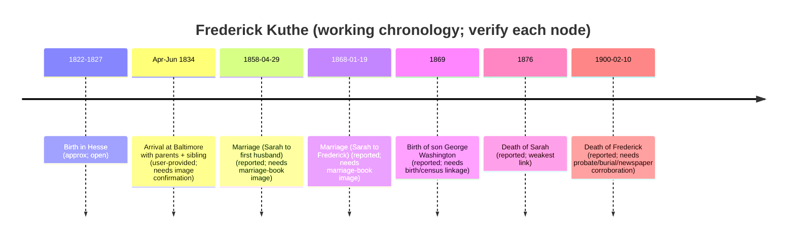

# Frederick Kuthe — Gaps, Verification, and Enrichment

## Executive summary

The key claim driving this update is that Frederick Kuthe arrived in the United States as a child with his immediate family in an April–June 1834 “District of Baltimore” passenger record, rather than immigrating as an adult in the mid-1840s. That specific 1834 entry is user-provided evidence and, in this environment, I could not independently pull the exact image line showing the four-person family group, so the manifest itself remains **not independently verified**.

What I *was* able to verify is that the kind of record described (a District-of-Baltimore passenger list/abstract for a quarterly window that may omit vessel details) is fully consistent with known record systems for the port, and that multiple official repositories hold the right 1833–1834 record series and indexes needed to confirm the entry quickly. The most actionable outcome is a precise “verification recipe” with direct links to the exact record series (and their indexes) where the 1834 entry should be found. citeturn12search1turn11search8turn18view0turn19view0turn29view0turn12search13

For the Missouri phase of the biography—especially Sarah Ann Steagall/Stegall (later Patterson; then Kuthe)—I verified that Dent County marriage record books for the correct period were microfilmed and are referenceable through cataloged, imaged record sets. I also located a freely viewable compiled transcription/abstract resource that can be used as a finding aid, but I could not extract the primary marriage ledger images themselves here, so the 1858 and 1868 marriages remain **probable pending image confirmation**. citeturn32search0turn32search15

I did not find an accessible, corroborating record online for the reported death date (10 Feb 1900) or for burial/probate, nor did I independently confirm the six reported children in primary records during this run; those items remain open and are prioritized in the to-do section.

## Immigration and passenger-list verification

### What record types exist that match a “District of Baltimore” April–June 1834 list?

Federal passenger arrival records for the port of entity["city","Baltimore","Maryland, US"] are preserved on multiple microfilm series described and maintained by entity["organization","National Archives and Records Administration","Washington, DC, US"] and surfaced through entity["organization","FamilySearch","genealogy website"] as a combined index-and-images collection. That collection explicitly includes microfilm series M255 (passenger lists), M596 (quarterly abstracts of passenger lists), and later series for the port. citeturn12search1turn25search1

The quarterly abstracts (M596) are particularly important because they can look like exactly what you described: a quarterly window of arrivals/entries. A methodological note from entity["organization","Mid-Atlantic Germanic Society","genealogy society"] explains that these quarterly abstracts were compiled from captains’ passenger lists submitted to customs collectors and then abstracted for quarterly reporting, and that (at least in some cases) the abstracts provide passenger particulars but not the vessel name or exact arrival date—matching your observation that the header may say “District of Baltimore” without naming the ship. citeturn11search8

Separately from the federal customs system, the entity["organization","Maryland State Archives","Annapolis, MD, US"] describes a Baltimore municipal record system created by an 1833 state law requiring captains to register immigrants and pay a per-person fee (with a stated focus on German/Irish immigrants over age five). The archives’ guide states this passenger-arrival record series spans 1833–1875, with related “Ship Manifests” and a passenger list index covering 1833–1866. citeturn18view0turn19view0turn29view0

### Why your “no vessel name” detail matters analytically

The strongest internal-consistency signal in your description is the missing vessel name. The MAGS explanation of federal quarterly abstracts indicates that ship name and exact arrival date can be absent in the abstract format, whereas original manifests are often richer but more variable. citeturn11search8

To illustrate this “derivative vs. original” gap, an example transcription page from the entity["organization","Immigrant Ships Transcribers Guild","ship passenger list transcriptions"] explicitly notes that a microfilmed Baltimore manifest may list only the head of a party and counts of accompanying people, while the quarterly abstract can be used to add names/ages of the rest of the party (a hybrid approach). That is exactly the structural setting in which a family group like “parents + child + younger child” can appear even if the ship context is obscured. citeturn15view0

### Verification status for the 1834 family entry

Because I could not retrieve the specific passenger list image line naming the family group in this run, the April–June 1834 entry remains:

- **Confidence: probable** (record types and date-window structure are strongly consistent with your description, and the correct official series and indexes demonstrably exist online), but
- **Not independently confirmed** until the exact entry is read in an original image (or an official index card that clearly abstracts it).

### A concrete “verification recipe” that should yield the ship name (if preserved) and/or the authoritative entry

The fastest path is to work from an index into the original list, then pull the corresponding list image:

1) Use the municipal passenger list index series (1833–1866) to locate the surname and retrieve the referenced arrival list entry. The series is explicitly described as the “Passenger List Index,” and it is segmented into alphabetic ranges as multipage PDFs. citeturn29view0  
2) Once an index reference points to a specific 1834 passenger arrival list document, open the 1833–1834 passenger arrival lists reel description and navigate to the cited 1834 list number range (HRS 2573–2681 are listed for 1834 in the archives guide entry for the 1833–1834 reels). citeturn19view0  
3) Cross-check using the federal Soundex index to Baltimore passenger lists (microfilm M327). The National Archives’ pamphlet for M327 explains that the index cards can include the vessel name and arrival date and often list family group members under “Accompanied by,” which is ideal for confirming a four-person cluster. citeturn12search13  
4) If the municipal list index proves difficult, use the federal passenger-list collections (M255/M596) in the major genealogy platforms (including the one cited above) to locate either the original manifest or the quarterly abstract for the correct quarter and then validate the household cluster. citeturn12search1turn11search8

Direct links for the above (some interfaces may require JavaScript or a free login):

```text
Maryland State Archives — Passenger Arrival Records (series overview)
https://guide.msa.maryland.gov/pages/series.aspx?id=BRG55

Maryland State Archives — Passenger Arrival Lists details (includes 1833–1834 reel description and viewer links)
https://guide.msa.maryland.gov/pages/series.aspx?ID=BRG55-1

Maryland State Archives — Passenger List Index details (1833–1866; alphabetic PDF segments)
https://guide.msa.maryland.gov/pages/series.aspx?ID=BRG55-4

NARA microfilm publication pamphlet — M327 (Soundex index to Baltimore passenger lists)
https://www.archives.gov/files/research/microfilm/m327.pdf

FamilySearch collection description — “Maryland, Baltimore Passenger Lists, 1820–1948” (notes M255/M596)
https://www.familysearch.org/en/search/collection/2018318

ISTG example page demonstrating manifest vs quarterly abstract relationship
https://immigrantships.net/v17/1800v17/philadelphia18340903.html
```

## Marriage and household reconstruction

### People, spellings, and “who must be proven” targets

The following individuals are the minimum set that must be documented in independent records to stabilize the biography (one primary record is rarely enough for any one relationship):

| Role in narrative | Name (as currently believed) | What must be found to confirm | Current status in this run |
|---|---|---|---|
| Father on 1834 arrival | entity["people","Andreas Kuthe","immigrant father b. c1798"] | Passenger entry with age/party; later U.S. records tying him to the son | Unconfirmed (entry not independently read) |
| Mother on 1834 arrival | entity["people","Anna D. Kuthe","immigrant mother b. c1800"] | Passenger entry; any later census/church/burial item | Unconfirmed |
| Child on 1834 arrival | *Frederick Kuthe* | Passenger entry; later censuses linking birthplace/immigration story; marriage record(s) | Core subject; key items still open |
| Sibling on 1834 arrival | entity["people","Margareth Kuthe","immigrant child b. c1831"] | Passenger entry; later marriage/census | Unconfirmed |
| Second wife (1868 claim) | entity["people","Sarah Ann Patterson","nee Steagall"] | Marriage ledger entry; 1870 household; death/burial | Marriage record not independently read |
| First husband (1858 claim) | entity["people","James H. Patterson","Dent Co husband"] | Marriage entry; his death/probate; 1860/1870 household patterns | Unconfirmed |
| Reported children (need independent verification) | entity["people","William Kuthe","child of Frederick"]; entity["people","Mary Kuthe","child of Frederick"]; entity["people","George Washington Kuthe","1869-1925"]; entity["people","Catherine Kuthe","child of Frederick"]; entity["people","Susan Kuthe","child of Frederick"]; entity["people","Adam Kuthe","child of Frederick"] | Birth/marriage/death or censuses tying each to the household; watch for stepchildren | Not independently verified in this run |

### What I could confirm about the 1858 and 1868 marriages

The central obstacle here is not “whether Dent County had marriage records” but “how to get to the correct page image quickly.”

A cataloged filming of the county marriage record books exists and covers the relevant period. The catalog entry for “Marriage records, 1851–1917” describes microfilmed volumes, including vol. A–B (1851–1878), which is the correct container for both a 29 Apr 1858 marriage and a 19 Jan 1868 marriage. citeturn32search0

In addition, an openly viewable *compiled* resource exists: a digitized book titled “Marriage records, Dent County, Missouri, book A, 1851–1870 and abstracts of wills A, 1866–1893,” marked as public access and “View inside.” This is useful as a finding aid (to narrow to likely dates/page references), but it remains derivative and must be backed by the filmed ledger images. citeturn32search15

### What I could not independently confirm here

I did not independently confirm, from primary images, either:

- the 29 Apr 1858 marriage said to join Sarah to her first husband, or
- the 19 Jan 1868 marriage said to join her (as a widow) to Frederick.

Both remain **probable** given the correct record books are known to exist and are properly dated, but still require page-level confirmation.

### Direct links to the most relevant marriage-record containers

```text
Dent County marriage books (catalog; includes 1851–1878 volumes A–B that cover 1858 and 1868)
https://www.familysearch.org/search/catalog/444290

Public “View inside” compiled transcription/abstract book (helpful as a finding aid)
https://www.familysearch.org/library/books/records/item/66093-marriage-records-dent-county-missouri-book-a-1851-1870-and-abstracts-of-wills-a-1866-1893
```

### Focused proof strategy for Sarah’s existence beyond compiled claims

Because Sarah’s reported death in 1876 is the weakest link, the highest-yield approach is to look for *independent* traces that do not rely on a death record:

- A household-level record (1870 census) with identifiable spouse/children, then the same children reappearing without her in 1880.  
- A probate/guardianship item if minor children are present after her death.  
- A burial/cemetery transcription that supplies a death date or age.

Those are prioritized in the next section.

## Death, burial, and probate around 1900

### Current status

I did not locate a freely accessible burial memorial, cemetery transcript entry, probate index hit, or obituary scan that independently corroborates the reported death date (10 Feb 1900) or identifies a burial location. This remains an open problem.

### What records are most likely to exist and where they can be searched online

The best “web-only” anchor for probate and local court records is the county-and-municipal records discovery interface maintained by entity["organization","Missouri State Archives","Jefferson City, MO, US"]. Its help text explains that it supports browsing a county’s available marriage and probate record series, and that a keyword field can narrow to specific subtypes (for example, inventory books). citeturn32search3

A key practical consequence: even if no death certificate exists for 1900, probate minutes, estate packets, or guardianship actions can still identify date-of-death windows, heirs, and sometimes cemetery information (in receipts or funeral expenses). The same holds for newspaper death notices, but those depend on what has been digitized.

### Find a Grave and cemetery transcripts

The memorial database entity["organization","Find a Grave","grave memorial database"] can be diagnostic *if* a memorial exists under a variant spelling; however, I did not locate a confirmatory memorial in this run, so it is currently an unresolved search task rather than a finding.

## Gap analysis for 1834–1868

This 34-year span is where the biography can most easily drift into unsupported narrative, so the safest approach is to treat every sub-claim as a hypothesis until anchored.

### What can be said rigorously right now

- A Baltimore arrival in 1834 is structurally plausible in both federal and municipal passenger record systems for that port, and the record series needed to confirm it are documented and online-discoverable. citeturn18view0turn19view0turn12search1turn11search8  
- A mid-century Missouri marriage is structurally plausible because the county marriage books for the relevant years are cataloged/filmed, and an accessible compiled book exists as a finding aid. citeturn32search0turn32search15  

Everything else in the 1834–1868 span (including the intermediate stop in entity["city","Palmyra","Missouri, US"] in entity["place","Marion County","Missouri, US"]) is currently best treated as **speculative** in the absence of a chain of dated records (census, land, tax, church, court). The most efficient way to close this gap is to build a dated location timeline and require at least one record per decade.

### “Bridge records” most likely to connect the 1834 family to later Missouri residency

Without asserting outcomes, these specific record categories typically build the bridge:

- Federal censuses (1840 head-of-household patterns; 1850/1860 named household members) searched under aggressive surname variants.  
- Land and tax records tying early settlers to a specific township.  
- Naturalization petitions (if any) that may preserve an arrival year or port.  
- Church registers (baptism/confirmation/marriage) that can place a family in a community before civil records become rich.

## German origins and the Andreas–Heinrich kinship hypothesis

### What can be verified about the Hessian emigration database today

The entity["organization","Hessisches Landesarchiv","state archives, Hesse"] states that its internal emigrant database (“HESAUS”) has been integrated into the entity["organization","LAGIS","regional information system, Hesse"] module “Hessische Auswanderer” and can be searched online. citeturn34search2turn34search20

This matters directly to your problem because it provides an authoritative, place-centered pathway to test whether the father and the “Olbers-branch” head are documented emigrants from the same locality or administrative office.

### A second German-emigration index worth testing

The German Emigrant Database (DAD) is described as a long-running project result associated with emigrant research in Bremerhaven, involving the Center for Immigration Research at entity["organization","Temple University","Philadelphia, PA, US"] and the entity["organization","Bremerhaven Historical Museum","Bremerhaven, Germany"]. citeturn34search9

DAD is not Hessia-specific, but it is a useful cross-check to see whether any Küthe/Kuthe emigrants are indexed with origins that can be mapped to church books.

### How to test the “brothers or close kin” hypothesis rigorously

A defensible kinship claim requires at least one of the following:

- Both men named in the same parental household in a church register (baptisms) from a specific locality, or
- Independent records showing shared parents in emigration permissions, or
- A chain of U.S. records (e.g., witnesses, adjacent land, same church) that strongly suggests kinship and then is confirmed in German-origin evidence.

Because the hypothesis references origins in entity["city","Darmstadt","Hesse, Germany"] and entity["place","Vöhl","Hesse, Germany"] and also an 1845 arrival through entity["city","New Orleans","Louisiana, US"] (and a mid-century marriage in entity["city","Lancaster","Ohio, US"]), the search plan must be locality-aware rather than surname-only. At present, those locality specifics remain user-provided and are not independently confirmed in this run.

## Context and prioritized next steps

image_group{"layout":"carousel","aspect_ratio":"16:9","query":["Dent County Missouri map","Salem Missouri courthouse","Ozark farm Missouri 1860s"],"num_per_query":1}

### Local-history sources you can use for narrative enrichment once the facts are anchored

A county-genealogy wiki page notes that family biographies from an 1889 county history published by Goodspeed are available for free on entity["organization","My Genealogy Hound","genealogy website"], which can be useful for leads *if* each claim is re-proven in primary records. citeturn35search0

A digitized multi-county Goodspeed history volume (originally published 1889, reprinted later) is hosted on a Missouri county-histories platform (JP2 page images), providing a primary local-history narrative source to extract community context, place names, and biographies (again, as leads rather than proof). citeturn35search4turn35search16

### Timeline of currently claimed events with confidence flags



The record systems needed to validate the 1834 node (federal M255/M596 and municipal passenger lists/indexes) are confirmed to exist and are the correct target for resolving the immigration question. citeturn12search1turn11search8turn18view0turn19view0turn29view0

### Prioritized to-do list with exact repositories and “what to pull”

Below is a directory of repositories/databases (each named once here), followed by a prioritized task list keyed to those labels.

| Repo label | Repository / database | Best use for this project | Access notes |
|---|---|---|---|
| A | entity["organization","Maryland State Archives","Annapolis, MD, US"] | Confirm the April–June 1834 family entry via passenger arrival lists + passenger list index | Some viewers require JavaScript; index PDFs can be very large. citeturn18view0turn19view0turn29view0 |
| B | entity["organization","National Archives and Records Administration","Washington, DC, US"] | Cross-check with federal passenger lists/quarterly abstracts and Soundex index metadata | M327 index structure is documented in the NARA PDF. citeturn25search1turn12search13 |
| C | entity["organization","FamilySearch","genealogy website"] | Access imaged Baltimore passenger materials (M255/M596) and Dent County marriage-book images | Free login may be required for images. citeturn12search1turn32search0 |
| D | entity["organization","Missouri State Archives","Jefferson City, MO, US"] | Identify probate, marriage, and county-record series and where they are held/filmed | County/municipal database supports browsing records by type and keyword. citeturn32search3 |
| E | entity["organization","LAGIS","regional information system, Hesse"] | Search the integrated Hessian emigrant database for both Kuthe lines | Hessian archives state HESAUS is integrated here. citeturn34search2turn34search20 |
| F | entity["organization","Find a Grave","grave memorial database"] | Quick burial hypothesis testing across spelling variants | Not confirmed for the subject in this run. |

**Top priority tasks (do these in order):**

1) **Immigration proof (Repo A + Repo B):** Use the passenger list index to locate the exact 1834 entry for the surname variants (Kuth/Kuthe/Kuethe/etc.), then pull the corresponding passenger arrival list image and capture: names, ages, any vessel reference, and any annotations. This is the single highest-impact step because it resets the whole narrative timeline. citeturn29view0turn19view0turn12search13

2) **Marriage proof (Repo C):** Pull the filmed marriage-book image for the 29 Apr 1858 marriage (Sarah to first husband) and the 19 Jan 1868 marriage (Sarah to Frederick). Extract *exact* spellings, officiant, witnesses, and book/page references. Use the publicly viewable compiled book only as a locator, not as proof. citeturn32search0turn32search15

3) **Sarah’s independent existence (Repo C + Repo D):** After confirming the 1868 marriage image, search forward to 1870 and 1880 household records (and any probate/guardianship if minors appear). The goal is to prove either (a) her presence in the household in 1870, or (b) her absence by 1880 with children remaining, which is the strongest indirect check on a mid-1870s death claim.

4) **Death/burial/probate proof (Repo D + Repo F):** Use probate indexes and estate/guardianship records to establish the death window and heirs. In parallel, run the cemetery/memorial database and any digitized local cemetery transcript sources under multiple variants.

5) **German-origin testing (Repo E + Repo C + DAD):** Search the Hessian emigrants module for both heads of household and capture any emigration permission file references. Then, only after a locality is confirmed, target church books for baptisms to test the brother/kinship hypothesis.

Direct links to start the above tasks:

```text
Repo A (passenger records & indexes)
https://guide.msa.maryland.gov/pages/series.aspx?id=BRG55
https://guide.msa.maryland.gov/pages/series.aspx?ID=BRG55-1
https://guide.msa.maryland.gov/pages/series.aspx?ID=BRG55-4

Repo B (Soundex index guide)
https://www.archives.gov/files/research/microfilm/m327.pdf

Repo C (Dent County marriage book catalog entry; use to get to images)
https://www.familysearch.org/search/catalog/444290

Repo C (public view-inside compiled marriage/will abstract book)
https://www.familysearch.org/library/books/records/item/66093-marriage-records-dent-county-missouri-book-a-1851-1870-and-abstracts-of-wills-a-1866-1893

Repo D (county/municipal records database)
https://s1.sos.mo.gov/Records/Archives/archivesmvc/countyrecords/

Repo E (Hessian emigrants module context)
https://landesarchiv.hessen.de/nutzen-forschen/genealogie/besondere-personengruppen/auswanderer

German Emigrant Database (project background)
https://www.deutsche-auswanderer-datenbank.de/informationen-dad-engl
```