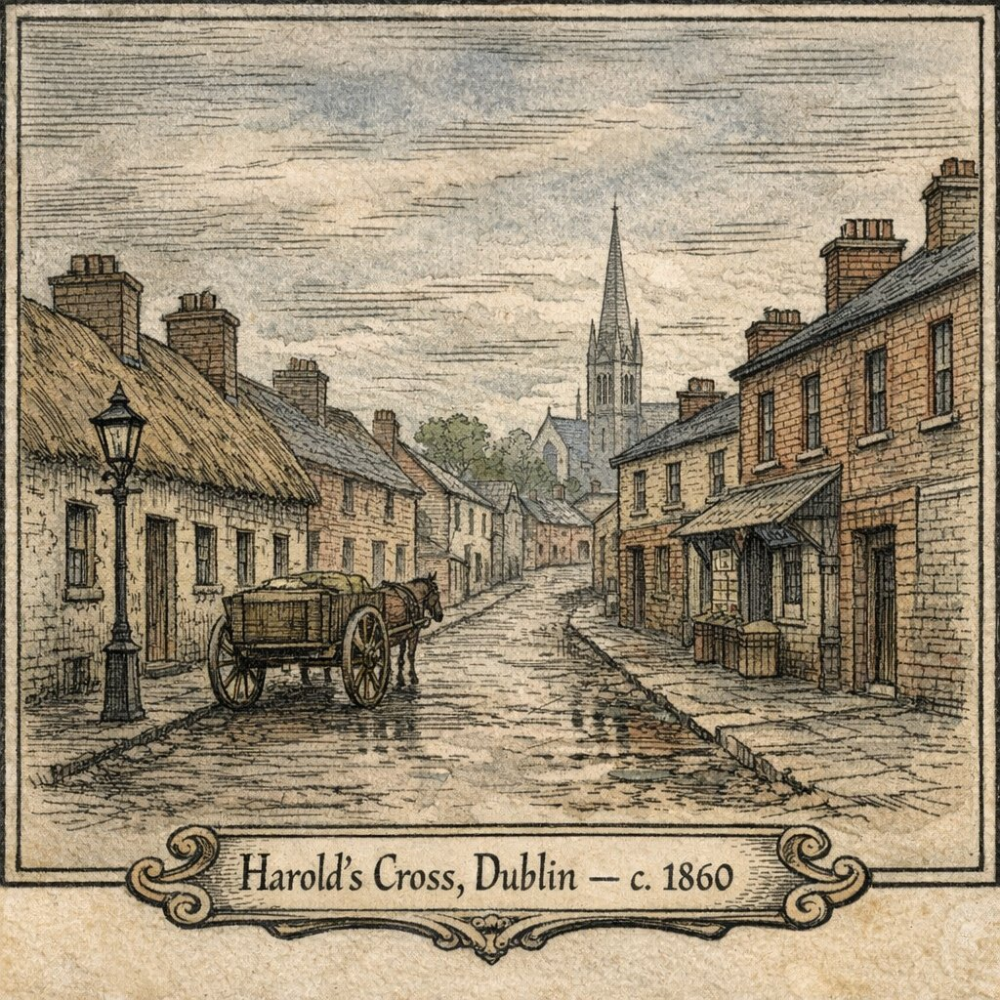
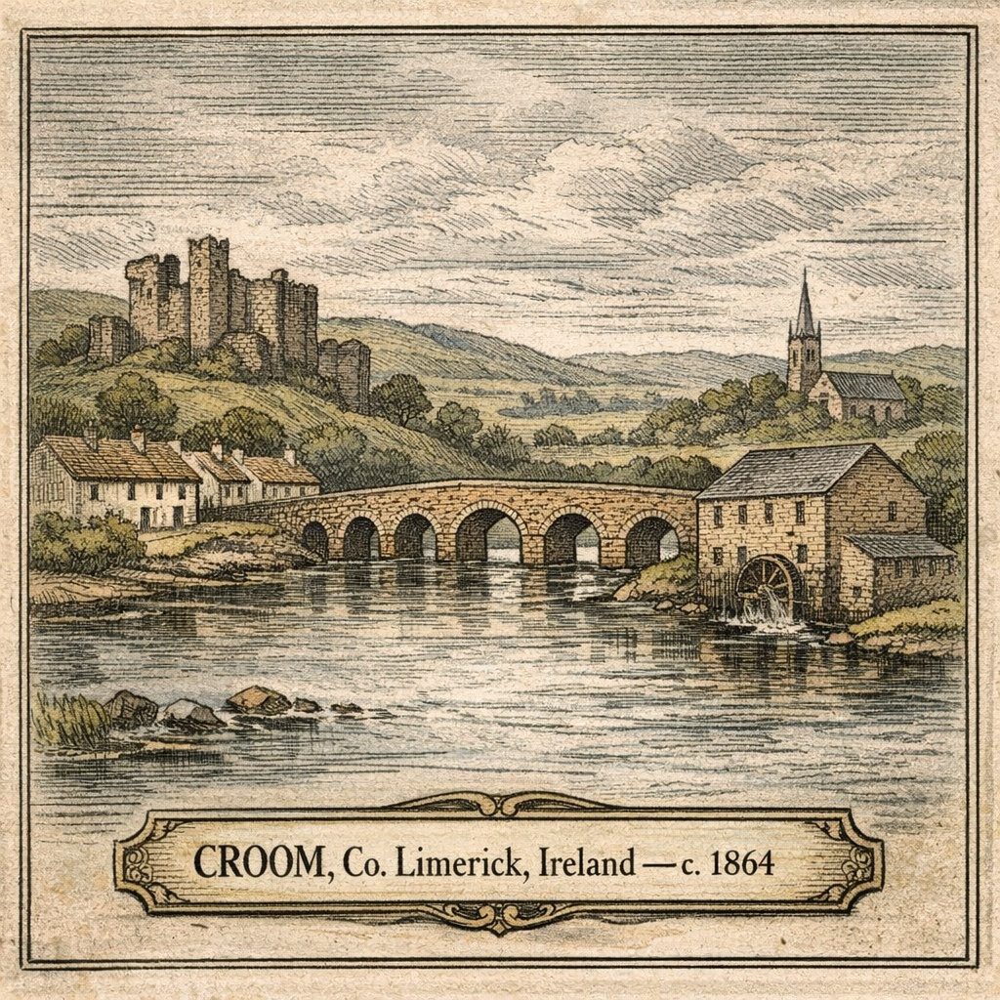

## **Ireland**
*The Old Country: Dublin, Limerick, and Sligo*

Four of my ancestral lines trace back to Ireland, spanning three provinces and a century of upheaval. They lived through the Great Famine, watched their neighbors board coffin ships, and eventually joined the tide of emigration themselves—some to England, most to America. By 1890, nearly all had left.

---

### Dublin

The **Higgins** and **Eustace** families lived in Dublin's southern suburbs—working-class neighborhoods of laborers, laundresses, and tradesmen clustered around Harold's Cross, Rathmines, and Rathfarnham.

**James Higgins** (1830–1880) and **Jane Eustace** (1829–1911) married in 1850, just as the Great Famine was ending. They raised eleven children at addresses like Fulham's Lane and Loughawn in Harold's Cross. James worked as a laborer; Jane outlived him by thirty years, working as a laundress into her seventies before dying in the South Dublin Union workhouse.

Their son **Laurence Higgins** (1854–1930) married twice in Dublin before emigrating to America. His first wife, **Mary Verner** (c. 1852–1881), died at the South Dublin Union after giving birth to twins there—a sign of the destitution that plagued even working families. Laurence's second wife, **Mary Knight**, came from Sligo.

Jane's father, **James Eustace** (c. 1798–1866), married Margaret Conlan at Rathfarnham in 1821. The Eustace family had deep roots in the area—the name appears in parish records going back generations.

**Dublin Bios:**
- [James Higgins (1830–1880)](../reports/html/james_higgins_bio.html) — laborer, father of eleven
- [Jane Eustace (1829–1911)](../reports/html/jane_eustace_bio.html) — laundress, widow
- [Laurence Higgins (1854–1930)](../reports/html/laurence_higgins_bio.html) — emigrated to Newark

---

### County Limerick

The **Gleeson** and **Fitzgerald** families came from County Limerick in Munster, the southwestern province hardest hit by the Famine. The town of **Croom**, on the River Maigue, was home to both families.

**James Fitzgerald** (c. 1830–1897) and **Maria Ann Gleeson** (1842–1918) married around 1863 and had at least seven children before emigrating to America in the 1880s. They settled in Newark, New Jersey—the same city where Laurence Higgins would arrive from Dublin.

Maria's father, **James Joseph Gleeson** (c. 1805–1864), was a shopkeeper in Croom. Her mother was Anne Madigan. The Gleesons were Catholic middling folk—not gentry, but not laborers either.

The Fitzgeralds and Gleesons represent a different slice of Irish emigration than the Dublin families: rural Munster rather than urban Leinster, though both ended up in the same Newark neighborhoods.

**Limerick Bios:**
- [James Fitzgerald (c. 1830–1897)](../reports/html/james_fitzgerald_bio.html) — Croom to Newark
- [Maria Ann Gleeson (1842–1918)](../reports/html/maria_ann_fitzgerald_bio.html) — shopkeeper's daughter
- [James Joseph Gleeson (c. 1805–1864)](../reports/html/james_j_gleeson_bio.html) — Croom shopkeeper

---

### County Sligo

**Mary Knight** (1866–1930), who became Laurence Higgins' second wife, was born in County Sligo in Connacht, the western province. She emigrated to America with her family as a teenager, then returned to Dublin to marry Laurence in 1883.

The Knights represent a third regional origin—Connacht, the poorest province, which lost the highest proportion of its population to famine and emigration. Mary's journey from Sligo to America to Dublin and back to America traces the complicated paths of 19th-century Irish migration.

**Sligo Bios:**
- [Mary Knight (1866–1930)](../reports/html/mary_knight_bio.html) — Sligo to Newark

---

### The Famine Generation

An Gorta Mór: The Great Hunger (1845–1852)

The Great Famine shaped every Irish family in this tree. When the potato blight struck in 1845, it destroyed the food source that sustained Ireland's rural poor. Over the next seven years, a million people died and another million emigrated. Ireland's population fell by 25%.

**James Higgins** was fifteen when the blight first appeared. He came of age watching Dublin fill with refugees from the countryside, watching the workhouses overflow, watching the coffin ships leave the quays. He married Jane Eustace in December 1850, as the worst was finally passing.

**James Joseph Gleeson** was a shopkeeper in Croom, County Limerick—better positioned than most, but witness to the devastation around him. Limerick lost a quarter of its population. His daughter Maria Ann was born in 1842, three years before the blight; she grew up in a landscape of empty cottages and unmarked graves.

The famine didn't just kill and displace. It created a culture of emigration that persisted for generations. The children and grandchildren of famine survivors left Ireland in waves—including nearly everyone in this family tree.

---

### The Workhouse

The South Dublin Union: Where Three Family Members Died

The workhouse system, established under the Poor Law of 1838, was designed to be a last resort—and deliberately harsh enough to discourage all but the truly desperate. For three members of this family, it became their final destination.

**Mary Verner** (c. 1852–1881), Laurence Higgins' first wife, gave birth to twins at the South Dublin Union in September 1881. She died there less than a month later, at age 29. The family had fallen into destitution.

**William Higgins** (1864–1892), son of James and Jane, died at the South Dublin Union at age 27. His last known address was Charlemont Street.

**Jane Eustace** (1829–1911), after decades as a widow supporting herself as a laundress, entered the South Dublin Union in 1908. She lived there for three years, dying of paraplegia at age 82. Her last address before the workhouse was Fulham's Lane—the same street where she had raised her children.

The South Dublin Union later became St. James's Hospital, still operating today. The workhouse buildings are gone, but the site remains a hospital—transformed from a place of last resort to a place of healing.

---

### Emigration to America

By 1890, most of these families had left Ireland:

| Family | Departed | Destination | Settled |
|--------|----------|-------------|---------|
| Fitzgerald/Gleeson | c. 1880s | Newark, NJ | Newark Ward 5 |
| Higgins (Laurence) | c. 1884 | Newark, NJ | Newark Ward 5 |
| Knight | c. 1870s | New York area | — |

Newark's Fifth Ward became an Irish enclave where families from Dublin and Limerick—strangers in Ireland—became neighbors in America. The Higgins and Fitzgerald families, from opposite ends of Ireland, ended up blocks apart.

---

**Lines from Ireland:**
- [Higgins Line](../../lines/higgins.html) — Dublin to Newark to Arizona
- [Gleeson Line](../../lines/gleeson.html) — Limerick to Newark to Arizona
